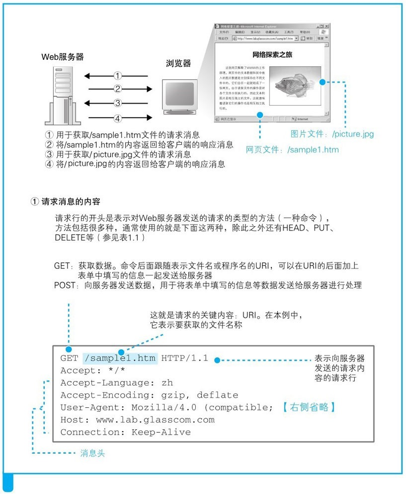
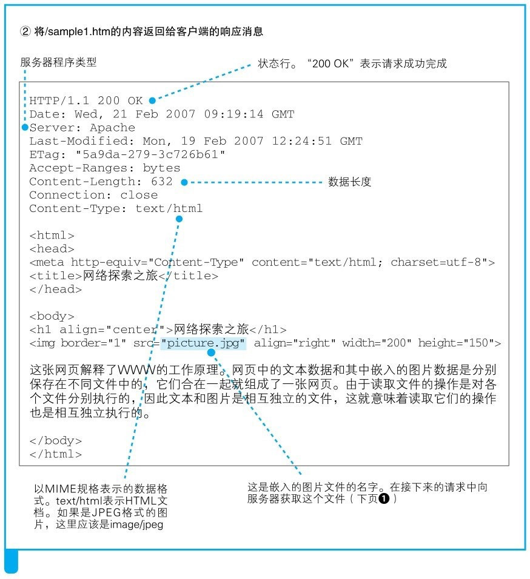

## HTTP

> 网络中点对点进行超文本（音视频、图片、文本等）传输的约定和规范；

<!--more-->

### HTTP 基础

#### URL 的解析

> http://www.xxx.com/dir/index.htm
>
> - 协议：http、ftp、file、mailto
> - 服务器域名 ：[www.xxx.com](www.xxx.com)
> - 文件在服务器的路径: /dir/index.htm

#### 生成 HTTP 请求消息

> - 请求行：请求方法（GET POST HEADE PUT DELETE ） 、URI 、 协议版本号
> - 消息头 ： 头部字段
> - 消息体 ： 存放提交的数据



####  生成 HTTP 响应消息

> - 状态行：协议版本号、状态码（1xx/2xx/3xx/4xx/5xx） 、响应短语
> - 消息头 ： 头部字段
> - 消息体 ： 响应的数据



#### 响应消息状态码

> - 1xx：已接收正在处理的中间状态；
> - 2xx：成功处理了请求
>   - 200：表示处理一切正常
>   - 204：表示处理成功，但没有 body
>   - 206：用于分片下载和断点续传，表示返回的 body 并不是资源的全部内容
> - 3xx
>   - 301：永久重定向，资源已被移动到新的地址，需要使用新的 URL 进行访问
>   - 302：临时重定向，资源还在，但暂时需要新的 URL 访问
>   - 304：表示资源未修改，重定向已缓存的文件
> - 4xx
>   - 400：客户端请求报文有错
>   - 403：客户端访问的资源被服务端禁止
>   - 404：客户端访问的 URL 地址不正确
> - 5xx
>   - 500：服务端错误，但错误未知
>   - 502：服务器作为网关和代理，访问后端服务器出错
>   - 503：服务器正忙，请稍后重试

#### HTTP 头部字段

> - Host：服务器域名
> - Content-Length：服务端响应数据的长度
> - Connection ： 客户端要求服务端的 TCP 持久连接；[Connection:Keep-Alive]
> - Content-Type: 通讯双方规定 MIME 内容格式：
>   - text/html; charset=utf-8
>   - multipart/form-data: 需要在表单中进行文件上传时，就需要使用该格式
>   - application/x-www-form-urlencoded : form 表单数据被编码为 key/value 格式发送到服务器
>   - application/json
> - Accept-Encoding：客户端支持的报文压缩算法
> - Content-Encoding:响应报文 body 的压缩算法

#### HTTP的请求方法

> + GET : 具有幂等性，查询使用，主要查询字符串的大小限制
> + POST ： 提交数据，不具有幂等性，多次提交会造成重复数据的产生
> + PUT ： 创建或者修改数据，具有幂等性，资源创建，则返回201表示已创建，资源更新则返回200或者204表示更新完成
> + DELETE ： 删除资源
> + HEAD ： 获取请求头（请求头与GET一致），使用场景下载大文件时，先会获取文件的大小，再决定是否要下载
> + PATCH ： 对资源进行部分的修改，需要设置CORS（Access-Control-Allow-Mehods）支持此请求方法
> + TRACE ： 有代理服务器的场景下使用
> + CONNECT ： 有代理服务器的场景下使用
> + OPTIONS ： CORS的预检请求的发送

### HTTP 特性

####  HTTP/1.1 相对 HTTP/1.0

> - 保持 TCP 的长连接，不必每次请求都要进行 TCP 的链接建立
> - 管道网络传输[ HTTP pipelining]，可不等服务端响应，一个 TCP 连接发送多个请求[但部分浏览器禁用]，但响应必须按照顺序返回，会造成队头堵塞[最早请求的没有处理完毕，后续的请求会被的阻塞]

####  HTTP/1.1 的缺点

> - 无状态：不保存请求的状态信息[cookie，session，token 等来解决]
> - 明文传输不安全 [https 解决]
> - 相同请求，头部报文臃肿，每次都需要传输[http/2 解决]
> - 只能由客户端发起，服务端被动响应[http/2 解决]
> - 队头堵塞：同时发送 3 个请求 A/B/C，如果 A 请求的处理时间较长，B/C 则会等待造成堵塞[http/2 解决]

#### 如何优化 HTTP/1.1

> - 使用缓存来避免发送 HTTP 请求[强缓存和协商缓存]
> - 传输内容体进行压缩处理 [协商压缩算法]
> - 小资源进行合并（雪碧图，使用打包工具合并文件）、减少请求发送（图片使用 base64）
> - 减少重定向的次数（使用代理服务器，将重定向的规则设置在代理服务器上，这样客户端就能减少请求次数）

### 缓存

#### 浏览器缓存（私有的）

> 浏览器对于指定用户的缓存

#### 代理缓存（共享缓存）

> 共享缓存可以被多个用户使用，例如，ISP或你所在的公司会假设一个WEB代理来作为本地网络基础的一部分提供给用户，这样热门的资源就会被重复利用；减少网络堵塞和延迟；

#### 强缓存

> - 强缓存也称为本地缓存：
>
>   - 当前浏览器再次请求相同的资源时，会从本地缓存该资源的 HTTP Header 中获取：Expires: Fri, 30 Oct 2020 14:19:41 GMT 或者 Cache-Control： max-age=36000（同时存在 Cache-Control 优先级高于 Expires）；
>   - 本地计算一个过期时间点 x（expirationTime = responseTime + freshnessLifetime - currentAge），如果当前新请求的时间点早于 x，则使用本地缓存不向服务端发起请求；
>
> - Cache-Control 可以设置的属性
>   - no-cache：不直接使用本地缓存，进行协商，如果资源没有改变则使用本地缓存
>   - no-store：直接禁止浏览器缓存数据
>   - public ： 指令表示该响应可以被任何中间人（译者注：比如中间代理、CDN 等）缓存
>   - private:  则表示该响应是专用于某单个用户的，中间人不能缓存此响应，该响应只能应用于浏览器私有缓存中。
>   - max-age=31536000 ： 设置过期时间
>   - must-revalidate ：意味着缓存在考虑使用一个陈旧的资源时，必须先验证它的状态，已过期的缓存将不被使用

####  协商缓存

#####  nginx配置协商缓存

> [配置](https://www.cnblogs.com/luozx207/p/11058348.html)

> 协商缓存都是由服务器来确定缓存资源是否可用[本地缓存已过期];
>
> - 第一次请求资源服务端在响应的头部会返回[两者可能只存在一个]：
>   - **Last-Modified**: Mon, 29 Jun 2020 2:28:12 GMT；
>   - **ETag**: "3e86-410-3596fbbc"
> - 第二次请求客户端会携带 **If-Modified-Since** ：值是**Last-Modified**；**If-None-Match**：值是**ETag**
> - 服务端首先会对比**ETag**如果相同则会返回**If-None-Match**：false；返回状态 304，客户端使用本地缓存；如果不相同返回**If-None-Match**：true；返回状态 200，客户端使用服务端新的资源


### CORS

> CORS的预检请求使用的是：OPTIONS
>
> 当一个请求（记做R）跨域并且不是简单请求的时候，浏览器会先向请求目标发送一个OPTIONS请求，通过OPTIONS请求判断是否发送请求R。

#### 请求

```http
OPTIONS /resources/post-here/ HTTP/1.1
Host: bar.other
Accept: text/html,application/xhtml+xml,application/xml;q=0.9,*/*;q=0.8
Accept-Language: en-us,en;q=0.5
Accept-Encoding: gzip,deflate
Accept-Charset: ISO-8859-1,utf-8;q=0.7,*;q=0.7
Connection: keep-alive
Origin: http://foo.example
Access-Control-Request-Method: POST
Access-Control-Request-Headers: X-PINGOTHER, Content-Type
```

#### 响应

```http
HTTP/1.1 200 OK
Date: Mon, 01 Dec 2008 01:15:39 GMT
Server: Apache/2.0.61 (Unix)
Access-Control-Allow-Origin: http://foo.example  【允许访问的来源地址】
Access-Control-Allow-Methods: POST, GET, OPTIONS  【允许访问的HTTP请求方法】
Access-Control-Allow-Headers: X-PINGOTHER, Content-Type  【允许自定义的http头部自定义字段】
Access-Control-Max-Age: 86400  【在指定的时间内不需要再次发起options方法进行校验】
Vary: Accept-Encoding, Origin
Content-Encoding: gzip
Content-Length: 0
Keep-Alive: timeout=2, max=100
Connection: Keep-Alive
Content-Type: text/plain
```

#### CORS的常见错误

##### CORS请求不是HTTP

> CORS请求只能使用HTTPS URL方案，通常此情况会发生在本地（file://）的URL

##### CORS 头 'Access-Control-Allow-Origin'与'xyz'不匹配

> 可能设置了多个相同的请求头部【Access-Control-Allow-Origin】

### CSP

> 内容安全策略

#### nginx配置

> add_header Content-Security-Policy "base-uri 'self';"

```html
<meta http-equiv="Content-Security-Policy" content="base-uri 'self'">
<base href="http://example.com/">

<!--当前的域名是：http://example.com，如果设置base不一致则会报错-->
```

#### 图片

> Content-Security-Policy: img-src https://example.com/

```html

<!--会被阻止-->
```


> 资料来源：
>
> - 《图解 HTTP》
> - 《小林 coding - 图解计算机基础》
> - 《网络是怎么连接的》

