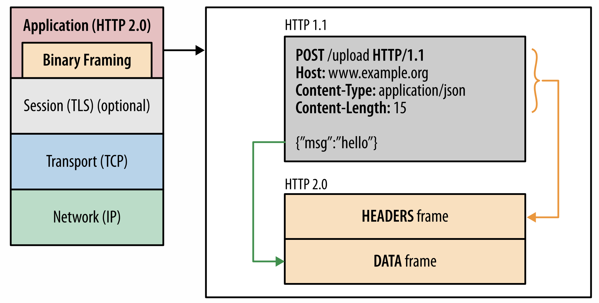
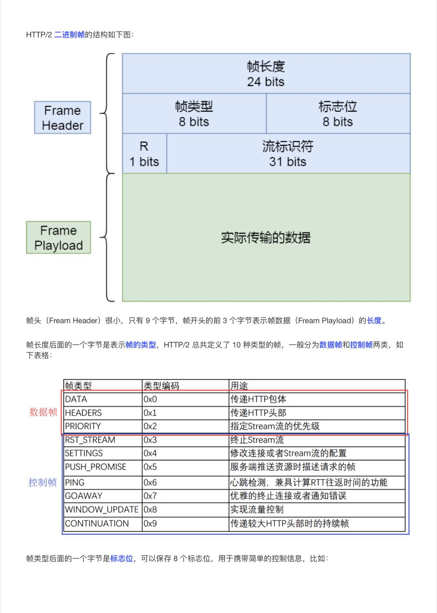
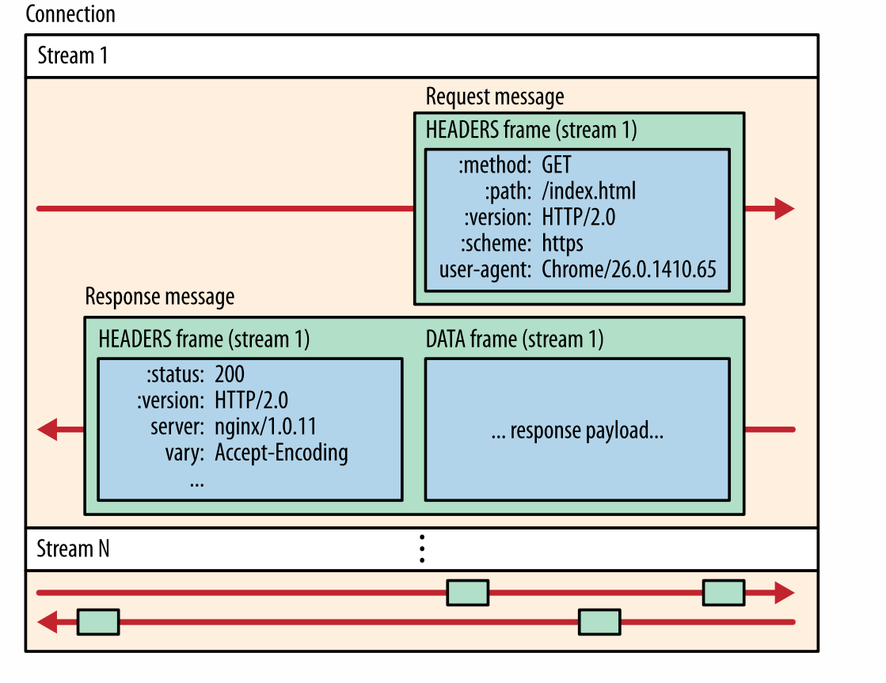
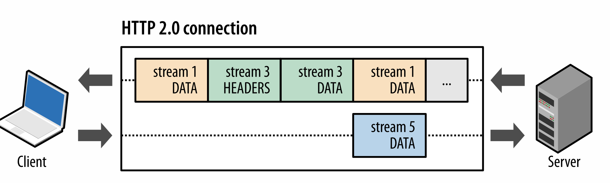
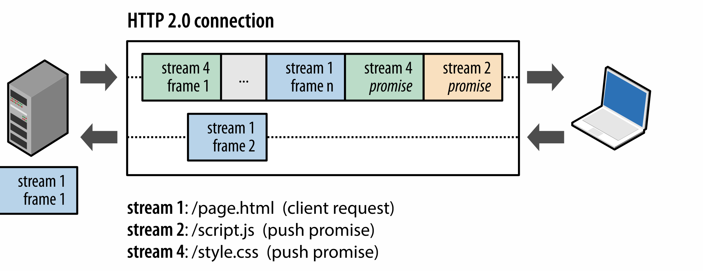
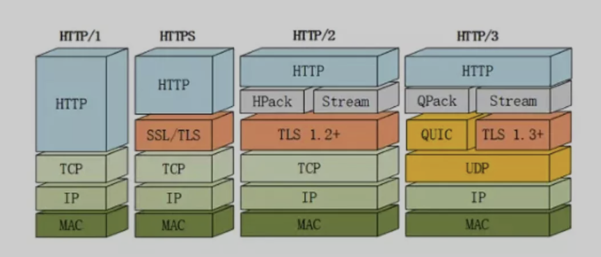

## HTTP/2

> HTTP/2 在 HTTP/1.1 的基础上主要做了以下优化：
>
> - 头部压缩
> - 通讯报文格式修改为二进制
> - 支持多路复用
> - 支持服务端推送
> - 提供请求优先级控制

<!--more-->

### 头部压缩

####  HTTP/2 

```shell
#URL	https://www.zhihu.com/commercial_api/banners_v3/home_up?
#Status	Complete
#Response Code	200
#Protocol	HTTP/2.0

:method	GET
:scheme	https
:path	/commercial_api/banners_v3/home_up?
:authority	www.zhihu.com


```

#### 为什么要头部压缩？

> + 请求和响应的报文头部信息有很多重复性的字段，例如 cookie，user-agent 等数据较大；
>
> + 每次数据交换都进行重复的头部信息的传递影响传输性能；

#### HPACK

> + 基础：通讯双方维护一个字典，发送方发送key值，接收方根据字典就能得到具体的内容
>+ 组成字典的有两个表
>   + 静态表： 列表每一行有三个值：index（序号），header name （头名称）header value（头名称的内容）；例如  2  :method  GET ;
>   + 动态表：根据指令动态进行添加
>+ [详细描述](https://segmentfault.com/a/1190000017011816?sort=newest)

####  服务端维护信息过多时[动态字典数据较多]如何处理？

> 类似 http_max_request 的配置，控制请求数量，防止动态表无限制的增大，到达极限后就自动断开 HTTP2 的链接

### 二进制帧

> HTTP/1.x 协议以换行符作为纯文本的分隔符，而 HTTP/2 将所有传输的信息分割为更小的消息和帧，并采用二进制格式对它们编码；（一个 http 消息可以由多个帧组成）
>
> 请求体和响应体内容变成二进制的形式传送，并且分为头部帧和数据帧两个部分；



####  帧的组成



### 多路复用

#### 数据流、消息、帧

> - **_数据流_[Stream]**: 已建立的连接内的双向字节流，可以承载一条消息。
> - **_消息_[message]**: 与逻辑请求或响应消息对应的完整的一系列帧。
> - **_帧_[Frame]**: HTTP/2 通信的最小单位，每个帧都包含帧头，至少也会标识出当前帧所属的数据流。



> **<u>以上概念的关系总结如下:</u>**
>
> - 一个 TCP 可以包含一个或者多个 Stream；Stream 是 HTTP/2 并发的关键技术；
> - 每个 Stream 都有一个唯一的标识符和可选的优先级信息，用于承载双向消息。
> - 每条消息都是一条逻辑 HTTP 消息（例如请求或响应），包含一个或多个帧。
> - 帧是最小的通信单位，承载着特定类型的数据，例如 HTTP 标头、消息负载等等。 来自不同数据流的帧可以交错发送，然后再根据每个帧头的数据流标识符重新组装。

#### 请求与响应复用

> HTTP/2 中新的二进制分帧层实现客户端和服务器可以将多个 HTTP 消息分解为互不依赖的帧，然后交错发送，最后再在另一端把它们重新组装起来。



> **基于多路复用可以实现以下功能：**
>
> - 并行交错地发送多个请求，请求之间互不影响。
> - 并行交错地发送多个响应，响应之间互不干扰。
> - 使用一个连接并行发送多个请求和响应。
> - 不必再为绕过 HTTP/1.x 限制而做很多工作（请参阅[针对 HTTP/1.x 进行优化](https://hpbn.co/optimizing-application-delivery/#optimizing-for-http1x)，例如级联文件、image sprites 和域名分片。
> - 消除不必要的延迟和提高现有网络容量的利用率，从而减少页面加载时间。

### 支持服务端推送

> 无需客户端明确请求，服务端可以向客户端推送额外的资源(CSS、JS 文件等)；

####  提前推送的好处

> 减少额外的延迟时间（js 文件的下载延迟）,使得客户端在使用资源时（已经推送到本地），可以直接使用缓存资源

#### 如何推送

> - 
> - Server 端推送数据流都由 **_`PUSH_PROMISE` 帧[帧的一种类型]_**发起请求，表明了服务器向客户端推送所述资源的意图；但该请求的顺序要在 client 端请求资源之前，由此避免 Client 端的资源重复请求；
> - Client 端接收到 `PUSH_PROMISE` 帧后，它可以根据自身情况选择拒绝数据流（通过 `RST_STREAM` 帧）。 （例如，如果资源已经位于缓存中，便可能会发生这种情况。）
> - 客户端发起的请求必须使用奇数号的 stream，服务端推送使用的是偶数号 stream，服务器在推送资源时会通过 PUSH_PROMISE 帧传输 HTTP 头部，并通过帧中的 Promise Stream ID 字段告知客户端接下来会在哪个 stream 中发送包；

### 流控

> - 建立 HTTP/2 连接后，客户端将与服务器交换 `SETTINGS` 帧，这会在两个方向上设置流控制窗口。
>
> - 流控制窗口的默认值设为 65,535 字节，但是接收方可以设置一个较大的最大窗口大小（`2^31-1` 字节），并在接收到任意数据时通过发送 `WINDOW_UPDATE` 帧来维持这一大小。

### 优先级控制

> HTTP/2 标准允许每个数据流都有一个关联的权重和依赖关系：
>
> - 可以向每个数据流分配一个介于 1 至 256 之间的整数。
> - 每个数据流与其他数据流之间可以存在显式依赖关系。
>
> _数据流依赖关系和权重的组合让客户端可以构建和传递“优先级树”，表明它倾向于如何接收响应。 反过来，服务器可以使用此信息通过控制 CPU、内存和其他资源的分配设定数据流处理的优先级，在资源数据可用之后，带宽分配可以确保将高优先级响应以最优方式传输至客户端。_

### HTTP/2 的缺点

#### 队头堵塞

> HTTP/2 基于 TCP 协议，TCP 是字节流协议，TCP 必须保证接收的数据是完整且连续的，这样内核才会将缓冲区的数据交给 HTTP 应用，当某一个字节流没有到达，后收到的字节数据只能放在缓冲区，只有等到该字节流到达时，HTTP2 应用才从内核中拿数据，这就是 HTTP/2 的队头堵塞问题；

#### TCP 与 TLS 握手延迟

> 发起 HTTP 请求，需要经过 TCP3 次握手、TLS 四次挥手因此需要 3 个 RTT 才能发送请求，TCP 由于拥塞控制，刚建立 TCP 链接时会慢启动

#### 网络迁移需要重新链接

> 一个 TCP 链接有四元组成【源 IP 地址，源端口、目的 IP 地址、目的端口号】，
>
> 例如：4G 切换到 wifi 会造成 TCP 的重新链接

## HTTP3

> 一个基于 UDP 协议的 QUIC 协议 --- HTTP3



#### 改进的拥塞控制、可靠传输

> 从拥塞算法和可靠传输本身来看，QUIC 只是按照 TCP 协议重新实现了一遍

#### 快速握手

> 由于 QUIC 是基于 UDP 的，所以 QUIC 可以实现 0-RTT 或者 1-RTT 来建立连接，可以大大提升首次打开页面的速度。

#### 集成了 TLS 1.3 加密

> - 在完全握手情况下，需要 1-RTT 建立连接。TLS1.3 恢复会话可以直接发送加密后的应用数据，不需要额外的 TLS 握手，也就是 0-RTT。
>
> - 但是 TLS1.3 也并不完美。TLS 1.3 的 0-RTT 无法保证前向安全性(Forward secrecy)。简单讲就是，如果当攻击者通过某种手段获取到了 Session Ticket Key，那么该攻击者可以解密以前的加密数据。
>
> - 要缓解该问题可以通过设置使得与 Session Ticket Key 相关的 DH 静态参数在短时间内过期（一般几个小时）。

#### 多路复用

> QUIC 是为多路复用从头设计的，携带个别流的的数据的包丢失时，通常只影响该流。QUIC 连接上的多个 stream 之间并没有依赖，也不会有底层协议限制。假如 stream2 丢了一个包，也只会影响 stream2 的处理

#### 连接迁移

> - TCP 是按照 4 要素（客户端 IP、端口, 服务器 IP、端口）确定一个连接的。而 QUIC 则是让客户端生成一个 Connection ID （64 位）来区别不同连接。
>
> - 只要 Connection ID 不变，连接就不需要重新建立，即便是客户端的网络发生变化。
>
> - 由于迁移客户端继续使用相同的会话密钥来加密和解密数据包，QUIC 还提供了迁移客户端的自动加密验证。

### 资料来源

> - [http2](https://developers.google.com/web/fundamentals/performance/http2#%E8%AF%B7%E6%B1%82%E4%B8%8E%E5%93%8D%E5%BA%94%E5%A4%8D%E7%94%A8)
> - 《小林 coding - 图解计算机基础》
> - [一文读懂 HTTP/1HTTP/2HTTP/3]
> - [队头堵塞](https://zhuanlan.zhihu.com/p/330300133)
