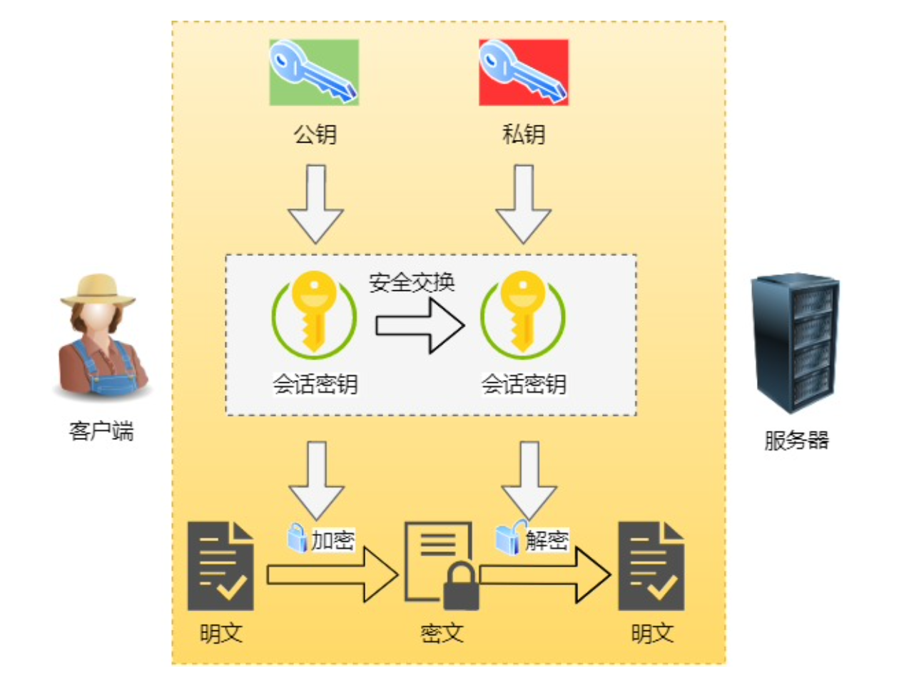
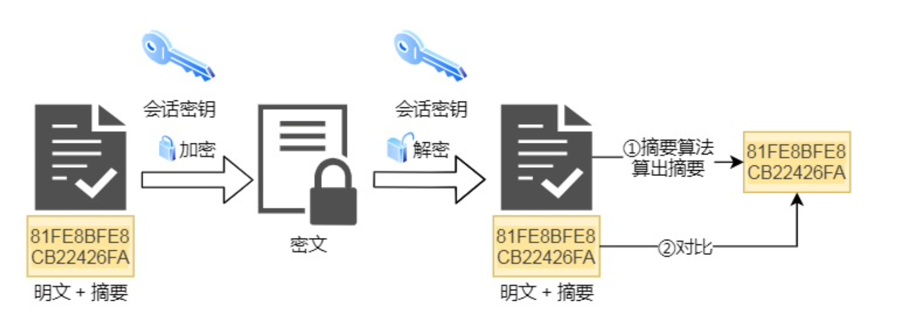
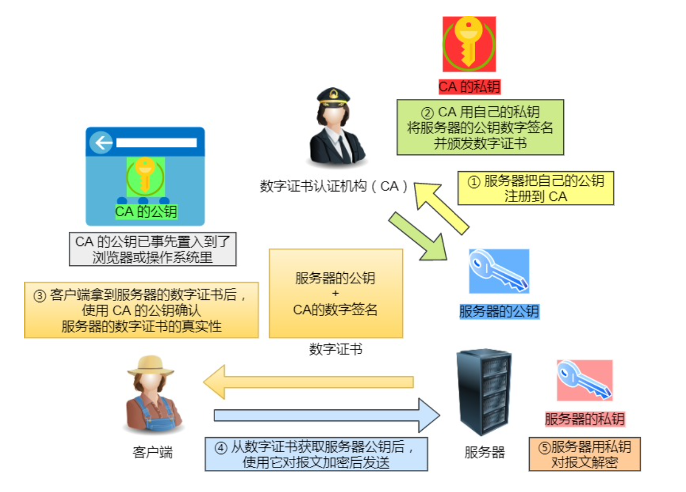
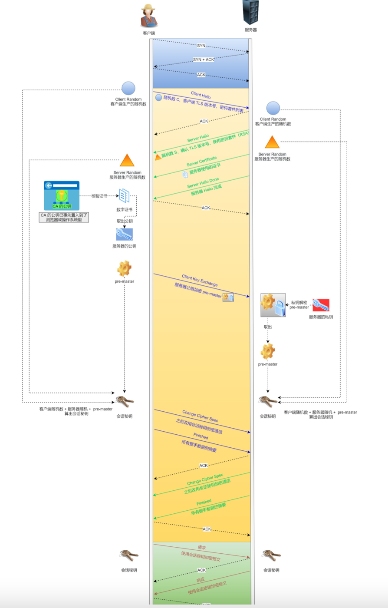
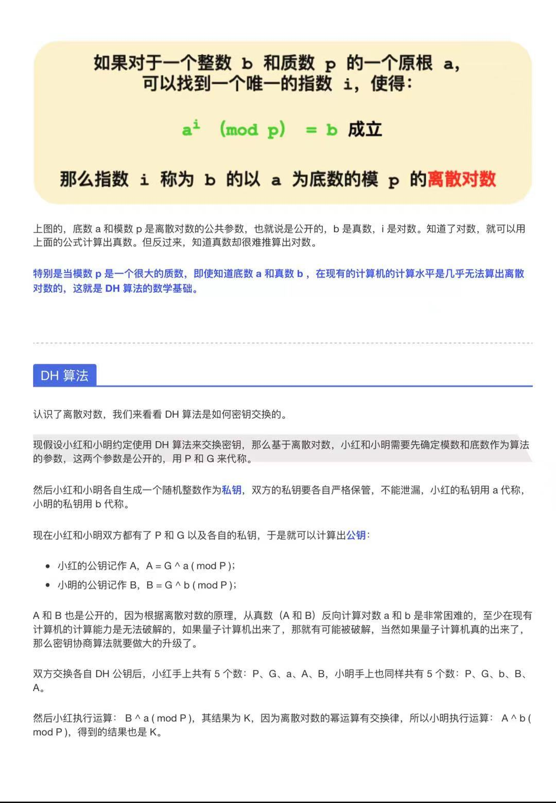

## HTTPS

### HTTPS 针对 HTTP 的优化

> HTTPS 在应用层和传输层之间增加了 SSL/TSL 协议可以很好的解决 HTTP 传输的不安全性：

<!--more-->

#### 混合加密

> 非对称加密交换秘钥，对称加密保证数据的密文传输；

#### 信息摘要

> 采用 hash 摘要算法，保证消息的完整性；

####  数字证书

> CA 证书验证，确认通讯方的身份；

##### 数字证书包含的内容

> - 公钥
> - 持有者信息
> - 证书认证机构（CA）信息
> - CA 对这份文件的数字签名及使用的算法
> - 证书有效期
> - 其他额外的信息

#####  数字证书如何颁发的

> - CA 会把持有者的公钥、用途、颁发者信息、有效时间等信息打包，然后对这些信息进行 hash 计算，得到 hash 值
> - 然后 CA 会使用自己的私钥将该 Hash 值加密，生成 certificate signature（证书指纹）也就是对证书做签名；
> - 最后将 certificate signature 放在数字证书上；

##### client 如何验证 HTTPS 证书

> 中间涉及证书信任链的验证

> - 拿到证书后，客户端对证书上的明文信息使用证书指定的 hash 算法进行运算得到 sign2，
> - 使用 CA 的公钥对证书的摘要进行解密得到签名 sign1
> - 比较 sign1 与 sign2 验证证书的合法性

### HTTPS 如何建立连接的

#### TLS 基于 RSA 的 4 次握手

> - client 向 server 发送：随机数（c）、TSL 版本号、加密算法套件列表；
> - server 接收后向 client 回复：随机数（s）、支持的 TSL 版本号，确认的加密算法套件、HTTPS 证书;
> - client 接收后验证证书的合法性，生成随机数（pre-master-key），使用服务端的公钥加密传输给服务端，同事根据三个随机数生成会话秘钥（master secret），加密将个随机数相加做 hash 运算的结果，然后传递给 server 端
> - server 端接收后使用私钥解密客户端的随机数（pre-master-key），然后将三个随机数做 hash 运算得到的值与 client 传递的 hash 作对比
> - server 端回传 client 加密算法更改的通知，使用协商的秘钥加密报文和报文的摘要传递给 client
> - client 接收后解密报文（对称加密秘钥解密），同时验证报文摘要的一致性；

#### RSA 的缺陷

> 客户端的秘钥传输使用的是服务端的公钥，如果服务端的私钥泄密了，那么公钥加密的秘钥就会泄露

#### HTTPS 的 ECDHE

##### 离散对数及 DH 算法

##### DHE 算法

> 根据私钥的生成规则分为：
>
> - static DH： 私钥一直保持不变
> - DHE：每次通讯双方私钥都是随机生成

##### ECDHE 算法

> 为了提高 DHE 算法的性能，采用 ECDHE 算法，基于 ECC 椭圆曲线特性

### HTTPS 的优化

#### HTTPS 性能损耗点

> - TLS 协议握手过程
> - 握手后的信息加密过程

#### 优化途径

> - HTTPS 是计算密集型的，因此可以采用硬件优化--CPU
> - 软件优化：Linux 内核及 OpenSSL 升级
> - 秘钥交换算法优化：将 RSA 替换为 ECDHE
> - TLS1.2 升级到 TLS1.3，[TLS1.3 的握手只需要一个 RTT]

### 资料来源

> - 《小林 coding - 图解计算机基础》
> - 《深入浅出 HTTPS》
