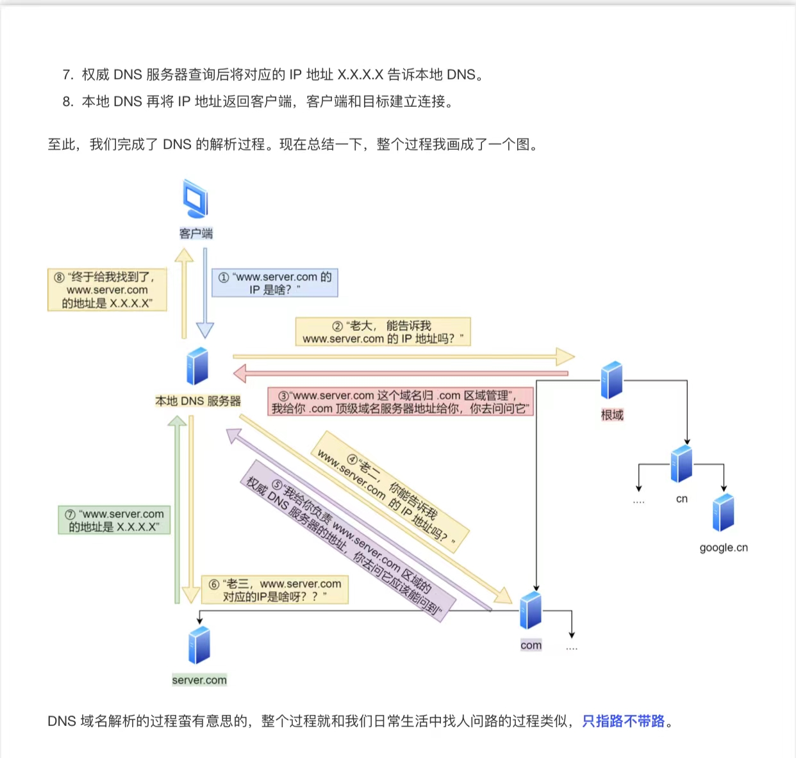
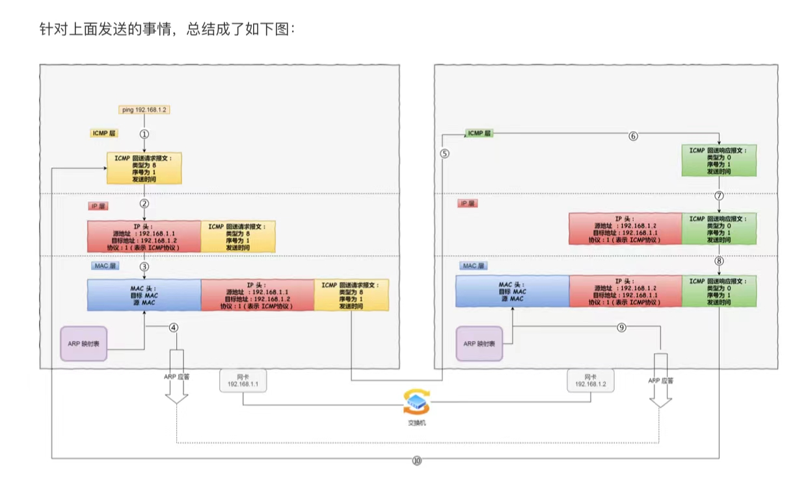

## IP 协议

### IP 基础

#### IP 协议

> IP 协议是位于网络层，实现主机与主机之间的通讯；

#### 网络层与数据链路层的区别

> - 数据链路层是实现直连的两个设备之间的通讯
> - 网络层是负责没有直连的两个设备在网络中的通讯传输

<!--more-->

#### IPV4

> IPV4 是 32 位的，每 8 位为一组

#### IPV6

> - IPV6 是 128 位的，每 16 位为一组

#### IPV6 的优点

> - 可分配的地址更多
> - 安全：有应对 IP 地址伪造和窃听的方案
> - 提高了传输性能：精简了头部结构，包头部固定值为 40 个字节

### IP 协议相关的技术

#### DNS

> - 将域名网址自动转化为 IP 地址

##### DNS 域名解析流程

> - 客户端发送一个 DNS 请求，向本地的配置的 DNS 服务器查询www.server.com，本地DNS服务器先从本地的缓存列表中查询，如果没有，则会向根域名服务器查询，
> - 根 DNS 服务器收到请求发现后置是.com，则会将.com 的顶级 DNS 服务器地址返回，本地 DNS 服务器再去查询.com 的顶级 DNS 服务器
> - .com 的顶级 DNS 服务器会将保存www.server.com域名IP的DNS服务器地址返回，本地DNS服务器再继续去查询，最终查询得到域名对应的IP地址

#### ARP

> 传输一个 IP 数据报，知道了源 IP 地址和目标 IP 地址，就会通过主机的路由表获取 IP 数据报下一跳，然而网络层下一个层是数据链路层，因此要通过 IP 地址获取下一跳的 MAC 地址 -- ARP 协议

##### ARP 如何获得 MAC 地址

> - 主机会通过广播发送 ARP 请求，
> - 当链路中所有的设备接收到广播时会拆分 ARP 协议中的内容，如果自己的 IP 地址和 ARP 协议中的 IP 地址一致，则会返回自己的 MAC 地址

#### NAT

> 将同个公司、家庭等内部的私有 IP 地址转化为公有 IP 地址

####  ICMP 协议

> - 互联网控制报文协议
>
> - 确认 IP 包是否成功送达目标地址，报告发送过程中 IP 包被废弃的原因和改善网络设置等

### ping 的工作原理

### 资料来源

> - 《小林 coding - 图解计算机基础》
