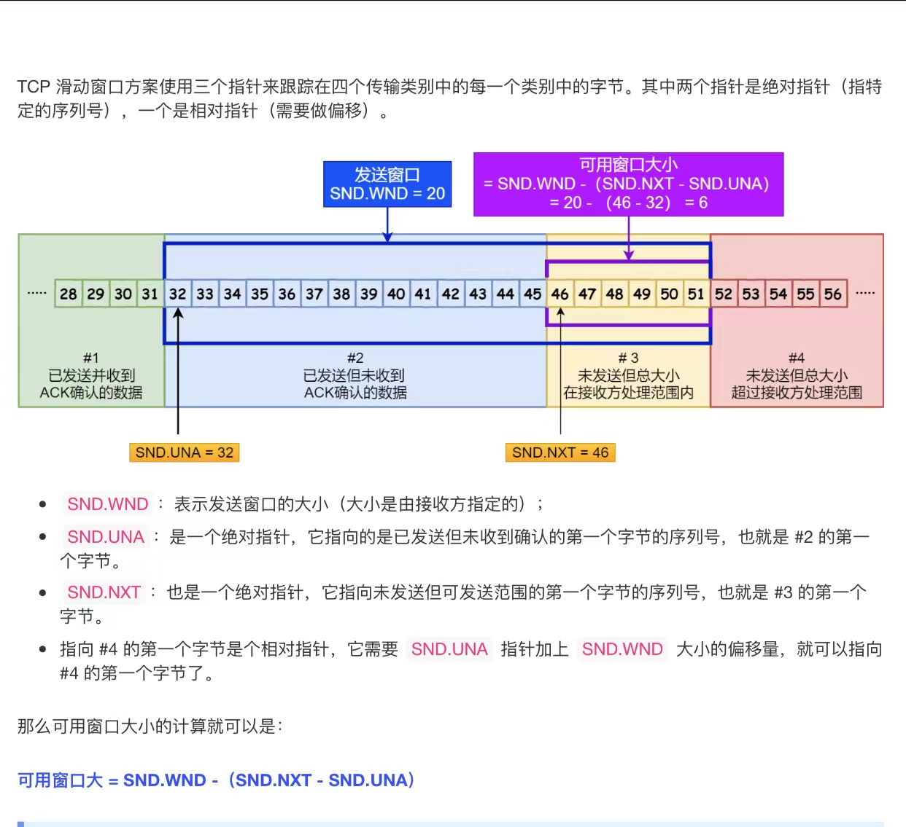
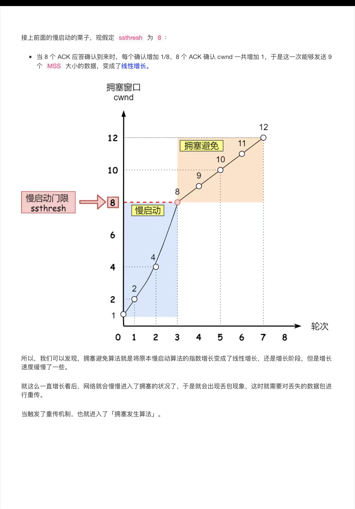
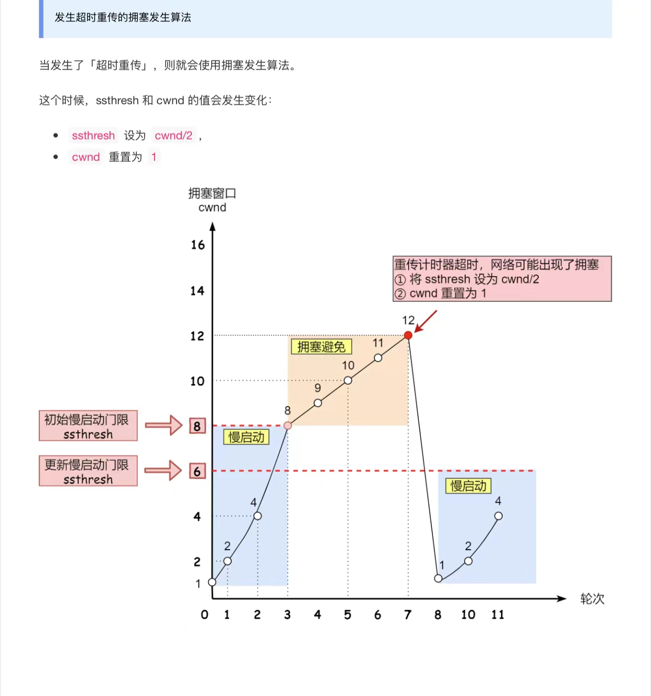
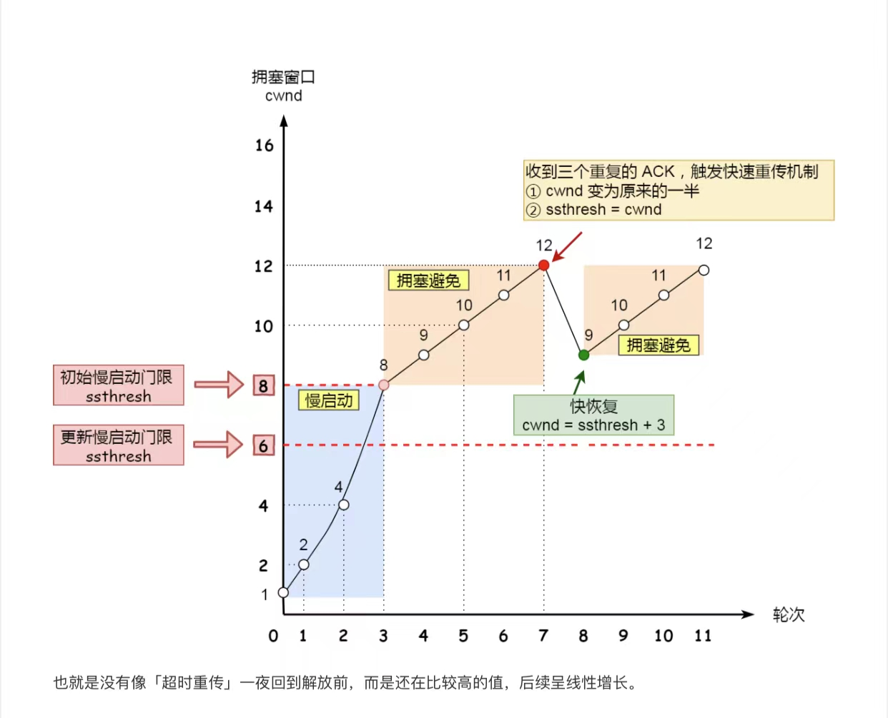

## TCP 基础

### TCP

> 面向连接、可靠的、基于字节流的传输层通讯协议；

#### TCP 头部

<!--more-->

#### UDP 与 TCP 的区别

> - 连接：TCP 需要建立连接，UDP 不需要
> - 服务对象：TCP 是一对一，UDP 一对一，一对多，多对多
> - 可靠性：TCP 保证可靠交付，UDP 尽最大努力交付
> - 拥塞控制、流量控制：UDP 没有，TCP 有
> - 首部开销：TCP 首部比 UDP 大
> - 传输方式：TCP 基于字节流，UDP 基于包
> - 数据丢失的处理方式不同：TCP 丢失哪个传递哪个，UDP 要重传；

### TCP 连接的整体过程

#### TCP 的三次握手

> - 第一步 client 生成以下报文内容交付服务端
>   - client 的端口号、server 的端口号
>   - SYN=1（TCP 头部控制位中的字段：表示连接操作）
>   - Sequence number = x（序号：表示 client 当前发送的是多少号数据，x 是个随机数，表示初始值）
>   - client 窗口大小；
> - 第二步 server 将以下报文传递给 client；
>   - client 的端口号、server 的端口号
>   - ack=1 （TCP 头部控制位中的字段：表示数据接收成功）
>   - SYN=1（TCP 头部控制位中的字段：表示连接操作）
>   - 确认应答号：ack number = x + 1 （发送数据的序号）
>   - Sequence number = y（序号：表示 server 当前发送的是多少号数据，y 是个随机数，表示初始值）
>   - server 窗口大小
> - 第三步骤：client 将以下数据传递给 server
>   - client 的端口号、server 的端口号
>   - ack=1 （TCP 头部控制位中的字段：表示数据接收成功）
>   - ack number = y + 1
> - 在第三步骤中可以传递数据

##### 握手第一步 SYN 包丢失？

> client 的[SYN]丢失，则 client 会超时重传，时间间隔 1，3，7，15，31（倍数增长），重传次数默认是 5 次（可以通过 tcp_syn_retries 参数来进行修改）

##### 握手第二步 SYN+ACK 包丢失？

> server 的[SYN+ACK]丢失，则 server 会超时重传；【在模拟场景中可以设置客户端防火墙】
>
> 重传次数默认是 5 次（可以通过 tcp_synack_retries 来进行修改）

##### 握手第三步 SYN 包丢失？

> Client 的[ACK]丢失，则 server 会超时重传；
>
> 重传次数默认是 5 次（可以通过 tcp_synack_retries 来进行修改）
>
> 当超过次数则 server 端会关闭此次 TCP 链接，
>
> 【此时 client 是建立连接的，数据包会超时重传。次数是多少呢？】
>
> 重传的次数是根据 tcp_retries2 决定的，默认是 15 次；超过 15 次就会断开连接

#####  TCP 三次握手的原因？

> - 避免历史链接：client 发送请求 A（sequence number = 90 ）到 server，但由于网络堵塞，client 认定超时后再次发送请求 B （sequence number = 100 ）到 server，结果 A 先到 B 后到，server 先返回 A 的请求，再返回 B 的请求；client 接收返回信息会验证 sequence number，A 请求已过期，此时 client 会发送 RST 报文终端此次链接；（如果采用 2 次握手则会导致服务端建立多余的链接，浪费资源）
> - 同步双发初始序列号：只有通过三次交互才能完成双方初始序号的交换与确认；

##### 什么是 SYN 攻击以及如何防范

> 攻击者通过伪造 IP 地址发送 SYN 进行连接请求，但是不响应服务端的确认连接报文，填满了服务端的 SYN 队列；
>
> 如何解决：当 SYN 队列满了时，服务端不再向队列中添加 SYN 请求，而是计算一个 cookie 值，并直接返回给客户端 ack+syn；

#### TCP 四次挥手

> - client 主动发起断开连接的请求发送 FIN=1,此时进入 FIN_WAIT_1 状态；
> - server 端接收到请求后，返回 ACK 确认，此时进入 CLOSE_WAIT 状态；
> - client 接收到确认 ACK 后，状态修改为 FIN_WAIT_2 状态；
> - server 处理完成数据后发送 FIN=1，进入 last_ack 状态；
> - client 接收到 FIN=1,返回确认 ACK，此时进入 TIME_WAIT 状态
> - server 端收到请求，修改状态为 closed；

##### 为什么要四次挥手

> - server 端在接收到第一个 FIN=1 时，client 端能接收数据但不在发送数据，server 此时可能存在要处理数据和发送数据
> - server 返回 ACK 确认只是告诉 client 端我已接收到断开连接的请求，你可以等着了；

#####  当客户端不发送数据，什么时候断开处于 ESTABLISH 状态的链接

> - TCP 保活机制：
>
>   - 定义一定时间段后如果没有数据交互，则开启保活机制；每隔一定时间发送一个探测报文；如果多次的探测报文都没有收到回应，则此 TCP 就是死亡的，此时客户端就会断开；
>
> - 涉及到的主要参数：
>   - 保活时间
>   - 探测次数：
>   - 探测间隔：

### 重传机制

> TCP 的重传机制主要包含：
>
> - 超时重传
> - 快速重传
> - SACK
> - D-SACK

####  超时重传

> 发送数据时会启动定时器，当出现数据包丢失或者确认应答丢失则会进行超时重传；

#### 快速重传

> + 不以时间为驱动，连续收到接收方的 3 个相同 ack 时则会触发快速重传；
> + ==快速重传存在的问题是只重传丢是的包，还是将丢失的包与丢失包之后的包一起重传；如何判断？==

#### SACK

> sack 是选择性确认，包含已接收数据包的序号，这样发送方就能确认该如何重传丢失的包，它存在于TCP的头部；
>
> 它可以将缓存的地图发给发送方，这样发送方就可以知道哪些数据收到了，哪些数据没有收到；进而只传递丢失的数据
>
> 

#### D-SACK

> D-SACK 主要是通过 SACK 告知发送方哪些数据是重复发送了，当接收方的应答报文没有收到，发送方会超时重传；

### 窗口

> + TCP 如果采用每个数据包都需要确认后再发送，则包的往返时间就会加大，网络吞吐量就会下降；
>
> + TCP 引入窗口概念，窗口大小就是指无需等待，可以发送数据的最大值

#### 滑动窗口

> 接收方和发送发操作系统设置的缓冲区代表窗口大小；
>
> TCP 滑动窗口方案使用三个指针来跟踪 4 个传输类别中每一个类别的字节；

### 流量控制

> 所谓流量控制是发送方根据接收方实际接收能力进行数据的发送

### TCP 的拥塞控制：

#### TCP 拥塞控制

> TCP 的拥塞控制主要依赖于拥塞窗口（congestion window：cwnd）；cwnd 是以字节来做单位，cwnd 增加 1 就相当于字节数增加 1 个 MSS 大小；
>
> 窗口值的大小就代表能够发送出去的但还没有收到 ack 的最大数据报文段，窗口越大那么数据发送的速度也就越快，但也就有可能使得网络出现拥塞；
>
> 拥塞控制算法就是使得网络吞吐量最大化且不产生拥塞

#### 慢启动

> TCP 建立连接后直接发送大量数据，会造成路由器缓存空间的耗尽，造成网络拥塞，因此不能在刚开始建立就大量发送数据，
>
> 而是根据网络环境桌布增加每次的发送数据量了具体操作:（RTT：网络的往返时间）
>
> 开始 ---> cwnd = 1
>
> 经过 1 个 RTT 后 ---> cwnd = 2\*1 = 2
>
> 经过 2 个 RTT 后 ---> cwnd = 2\*2= 4
>
> 经过 3 个 RTT 后 ---> cwnd = 4\*2 = 8
>
> 如果带宽为 W，那么经过 RTT\*log2W 时间就可以占满带宽。

#### 拥塞避免

> 从慢启动可以看出 cwnd 可以很快的增长起来（指数级增长），从而最大程度的利用网络带宽资源，但是 cwnd 不能无限制的增长，
>
> TCP 使用了一个慢启动门限（ssthresh）的变量（最大值是 65535 个字节），当 cwnd 超过该值慢启动过程结束，进入拥塞的避免阶段；
>
> 拥塞避免的主要思想是：加法增大，也就是 cwnd 不再是指数级别的增长，而是加法增加；线性增长

#### 拥塞状态

##### 超时重传-拥塞算法

#####  快速重传-拥塞算法

### 资料来源

> - 《网络是怎样连接的》
> - 《小林 coding - 图解计算机基础》  [2022-7-新网站](https://xiaolincoding.com/)
> - 《图解 TCP/IP》
