> 知识点汇总：
>
> + 浏览器生成消息
> + DNS解析域名
> +  探究协议栈与网卡
> + TCP握手与挥手
> + IP层网络包的传输

<!--more-->

###  浏览器生成消息-探索浏览器内部

#### 生成HTTP请求消息

> URL输入到浏览器地址栏或者发送ajax请求时，会经历URL地址解析、生成请求消息的步骤：
>
> + URL地址解析
>   + 协议名称（http、ftp、file等）
>   + 域名（host）
>   + 文件地址（URI-文件在web服务器上的地址）
> + 生成请求HTTP消息
>   + 请求行 （请求方法、URL、协议版本）
>   + 请求头部（附加一些请求的详细描述）
>   + 请求消息体（携带给web服务器的数据）

#### 向DNS服务器查询web服务器的IP地址

##### TCP/IP的结构

> 浏览器向web服务器发送请求的大致路径：
>
> + 浏览器位于子网中的某一台计算机中
> + 请求消息经过子网的集线器，到达链接子网的路由器层层转发最终到达web服务器所在的子网中

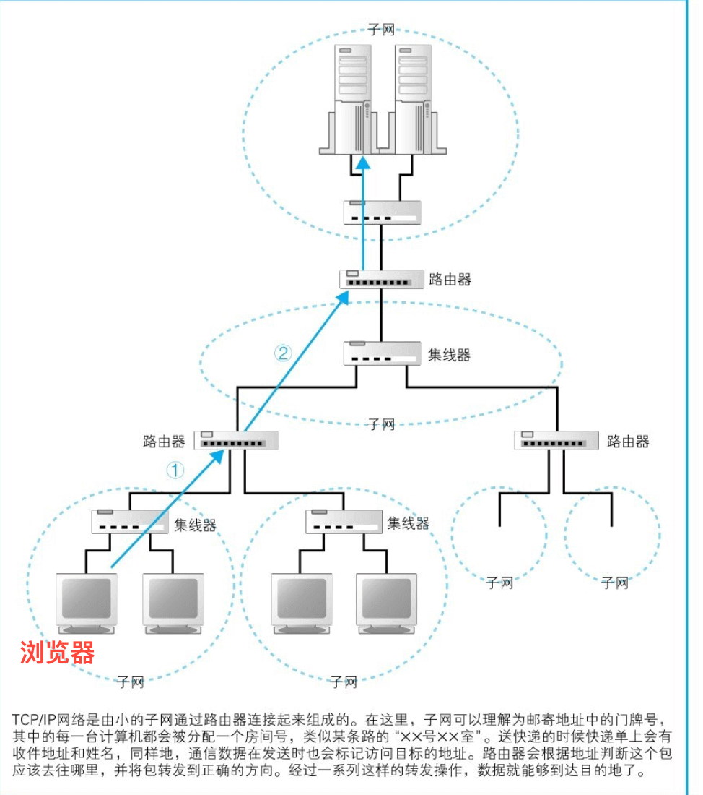

##### IP地址

> + 每台计算机在子网中都具有一个唯一的地址就是IP地址，它分为两部分：网络号（子网的地址）、主机号（具体的计算机）；
>
> + 目前的IP地址以IPv4为例是一串32位比特的数字，每8位使用圆点分割；
> + 使用子网掩码来区分IP地址中的网络号和主机号

##### 子网掩码

> 子网掩码表示IP地址中网络号与主机号之间的边界，是一串与IP地址长度相同的32位比特数字，左边一半全为1，右边一半全为0；子网掩码为1的部分表示网络号，子网掩码为0的部分表示主机号

##### 解析器

> 浏览器向DNS服务器发请求时，需要调用解析器（操作系统Socket库中的一个组件），由解析器完成整体请求，并将结果返回给浏览器

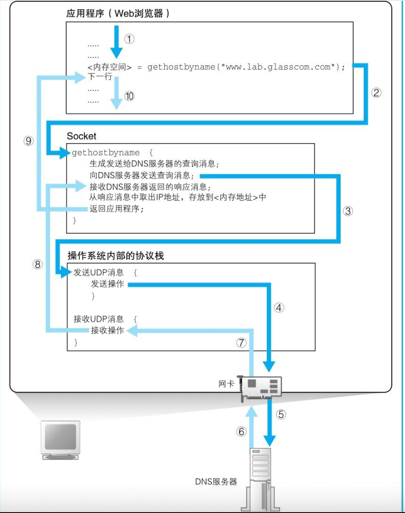

##### DNS服务器内部工作流程

> 图中展示的是DNS服务器的基本流程，现实情况中一台DNS服务器可能会管理多个域的信息，同时DNS服务器也会缓存一定的信息，避免每次的查找都要走基本查询流程；

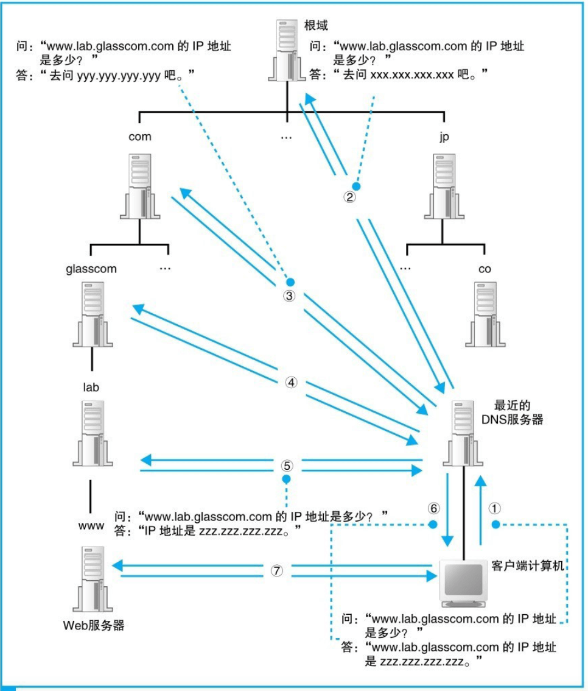

#### 委托协议栈发送消息

> 当请求消息已创建完毕，浏览器需要委托协议栈发送消息：
>
> + 先调用操作系统的Socket组件创建套接字，然后返回给浏览器一个描述符（标识套接字）
> + 调用connect方法传入：描述符、IP地址、端口号与服务端建立连接
> + 调用write模块写入数据
> + 消息有返回使用read模块读到缓冲区
> + 接收完毕，关闭连接（HTTP1.1中一个连接可以发送多个请求：Connection:keep-alive）

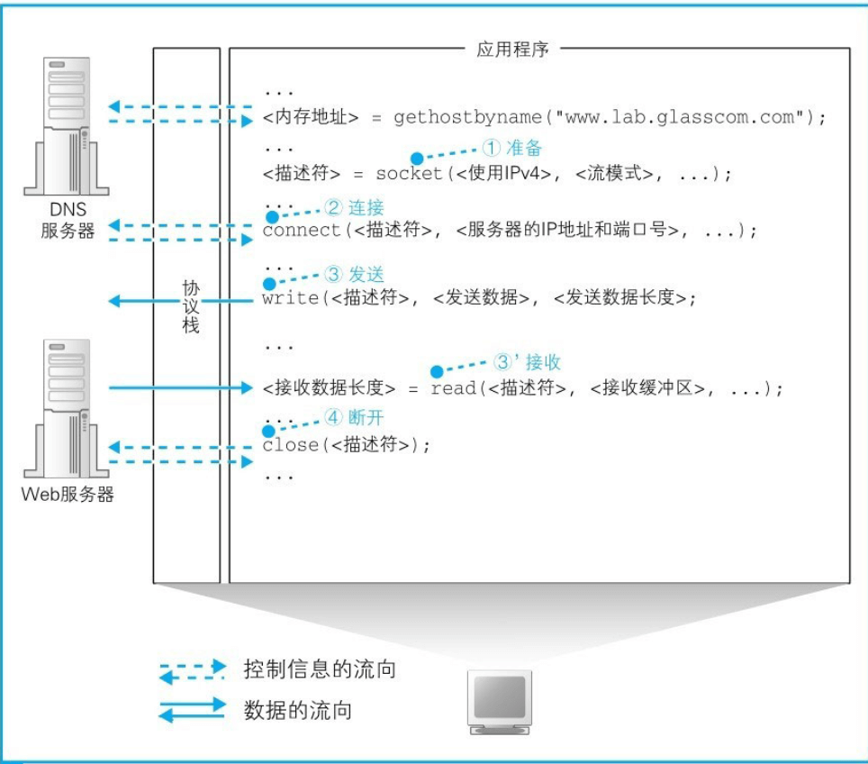

###  探究协议栈与网卡

#### 创建套接字

#####  协议栈的内部结构

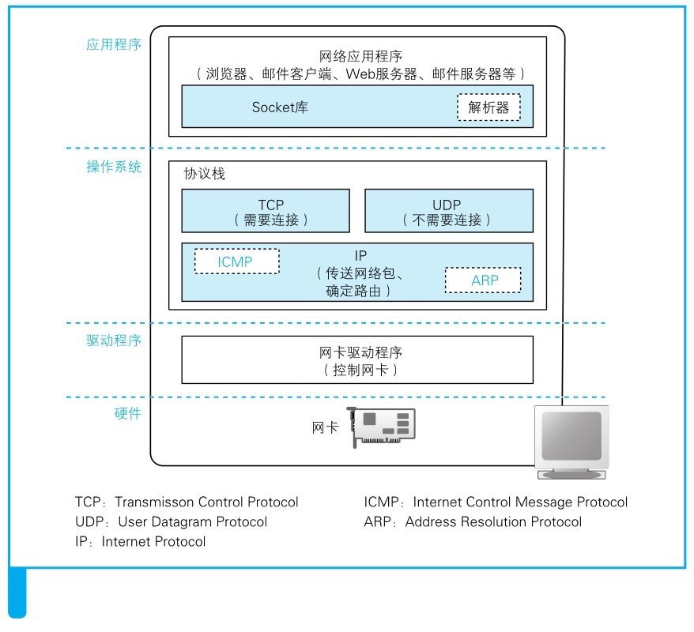

#####  套接字的实体

> 套接字的实体就是通讯的控制信息：通讯的 IP 地址、端口号、通讯操作的进行状态等

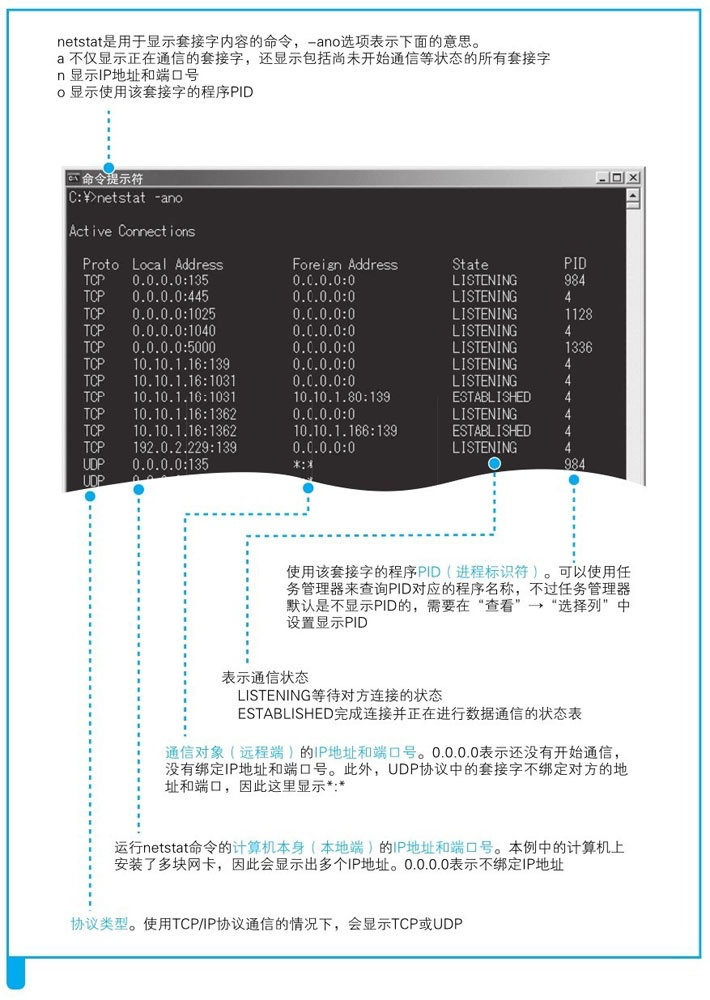

##### 调用套接字的操作

> - 协议栈首先会分配用于存放套接字所需的内存空间，并初始化相关信息，返回套接字描述符给应用程序
> - 协议栈将创建的套接字描述符传给应用程序
> - 应用程序进行通讯时使用套接字描述符找到套接字，传递报文

#### 连接服务器

> - 创建套接字成功后，应用程序（浏览器）通过 socket 调用 connect 函数
> - 进行与服务器建立连接的操作，首先进行 TCP 的 3 次握手，修改双方的通讯状态为 ESTABLISHED；
> - 接着请求数据在传输层被分割成块，每个块首部添加 TCP 头部信息交付给 IP 协议；
> - 然后在 TCP 网络包首部再依次添加 MAC 头部和 IP 头部信息
> - 数据包交付网卡进行传输

##### TCP 头部

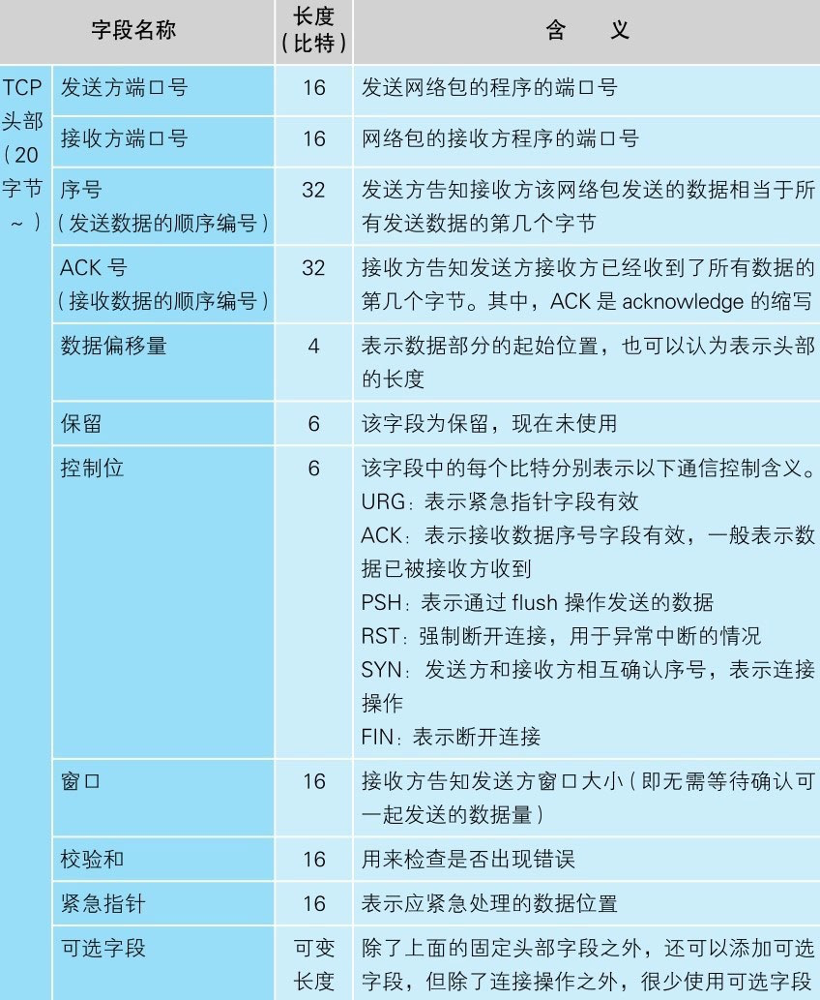

##### 连接操作

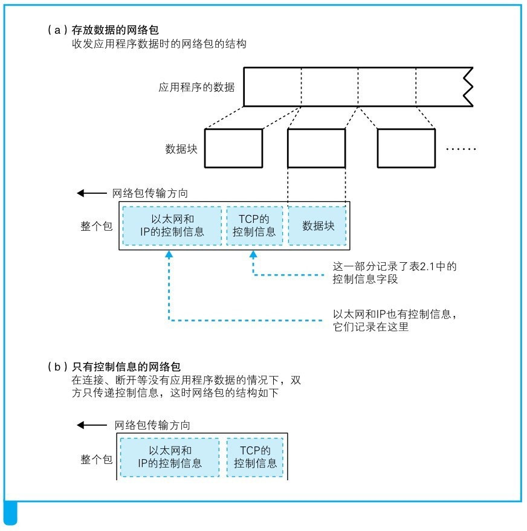

#### 收发数据

##### 将 HTTP 消息传递给协议栈

> HTTP 的报文数据会被发送到协议栈中的缓冲区内，缓冲区根据条件判断是否提交给协议栈发送数据，主要判断条件如下：
>
> - 缓冲区中的数据是否已达到一个网络包的最大长度：
>   - MTU，一般为 1500 个字节，它是网络包整体大小，包含头部，因此去除头部信息的网络包最大为 MSS；
> - 计时器：如果一直没有达到 MSS 则根据计时器是否到达指定时间，到达了也直接发送；

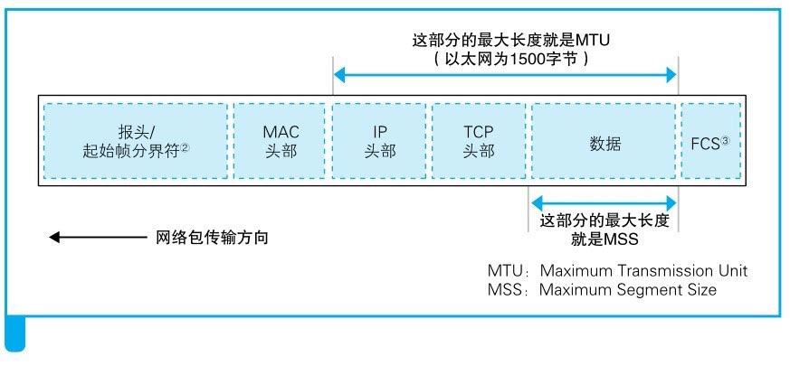

##### 对较大的数据进行拆分

> 协议栈缓冲区的数据会被拆分成一个个网络包，添加完头部信息后，再进行发送

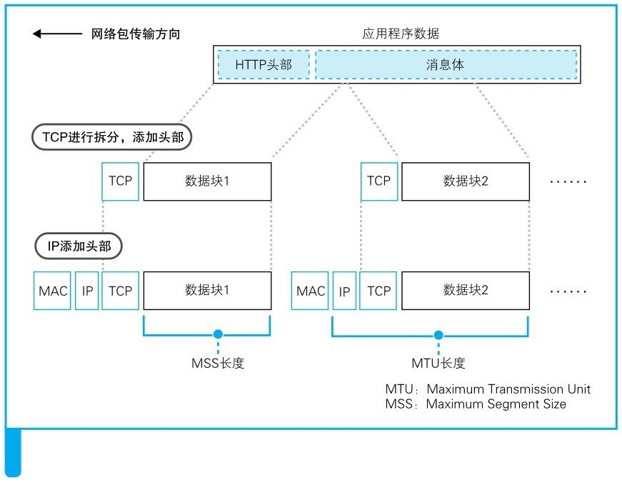

##### 使用 Ack Number 确认网络包已接收

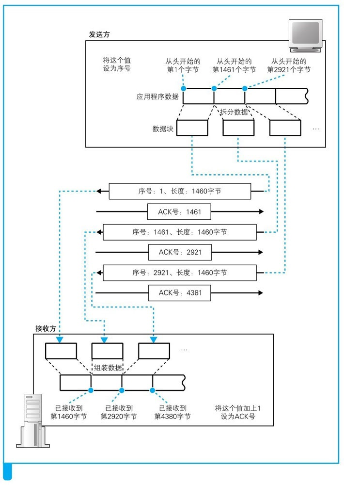

##### 根据网络包的平均往返时间调整 ACK 号的等待时间

> - 当网络传输繁忙容易发生拥挤，ACK 号的返回就会很慢，这时需要将 ACK 的等待时间调整的长一点，否则会出现重传包的情况，然后由于重复传包会加剧网络的拥挤；
>
> - 等待时间需要动态的调整，调整的依据就是 ACK 号的平均往返时间；

#####  使用窗口有效管理 ACK 号

> 滑动窗口：就是在发送一个包之后，不等待ACK号返回，而是直接发送后续的包，这样等待ACK号的这段时间会被有效的利用；但需要主要接收方缓冲区溢出的情况（发送方会根据控制信息中的窗口大小动态调控）

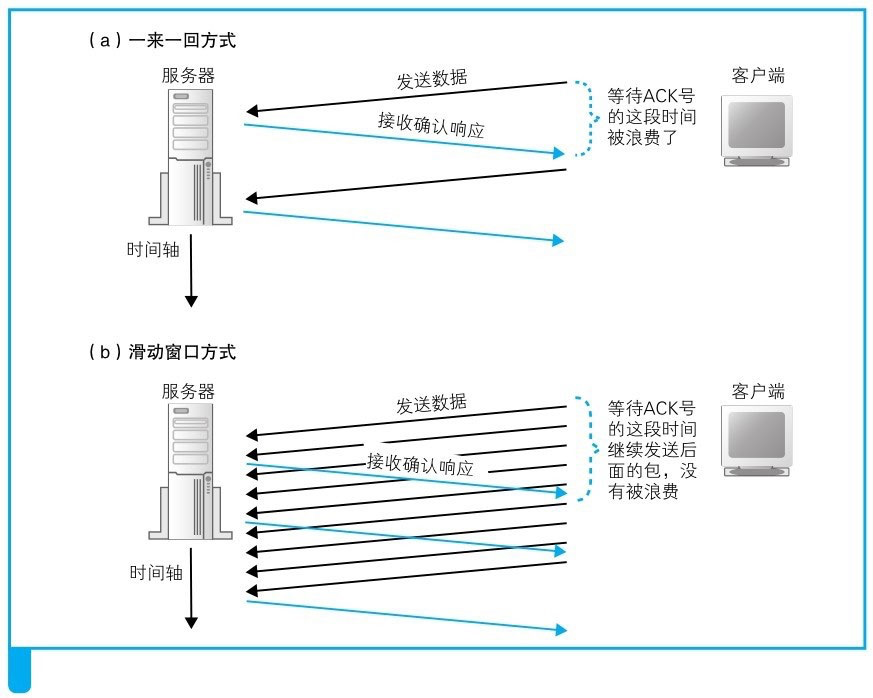

##### ACK 号与窗口更新合并

> - 使用一个网络包将窗口更新和 ACK 号一并返回给发送方；
>   + 窗口大小更新的时机是应用程序从接收方缓冲区拿走数据，此时缓冲区大小发生变化了
>   + ACK号确认可以设置等待一段时间，这段时间内可能会有多个ACK号，这样就可以合并减少包的传输
> - 当出现后发的网络包先到的情况如何处理？
>   - 有可能后发送的先到，但是收到未按序到达的报文段，接收方会发送 ACK 对前面未收到的报文段进行重复确认，这样做让发送方尽早知道前面的报文段还没有收到让发送方重传这些报文段。
>   - 快速重传算法规定，如果发送方连续收到 3 个重复的 Ack 就应该立即重传接收方未收到的报文段，不必等到这些报文段超时计时器到期在重传，假如在接收方发送重复 ACK 期间，前面的报文段又到了，那样发送方没有收到连续的 3 个 ACK 发送方也就不会重传这些报文段

#### 接收 HTTP 响应

> - 首先，浏览器在委托协议栈发送请求消息之后，会调用 read 程序来获取响应消息。
> - 然后，控制流程会通过 read 转移到协议栈 ，然后协议栈会执行接下来的操作。
> - 和发送数据一样，接收数据也需要将数据暂存到接收缓冲区中，这里的操作过程如下：
>   - 首先，协议栈尝试从接收缓冲区中取出数据并传递给应用程序，但这个时候请求消息刚刚发送出去，响应消息可能还没返回。
>   - 响应消息的返回还需要等待一段时间，因此这时接收缓冲区中并没有数据，那么接收数据的操作也就无法继续。
>   - 这时，协议栈会将应用程序的委托，也就是从接收缓冲区中取出数据并传递给应用程序的工作暂时挂起 ，等服务器返回的响应消息到达之后再继续执行接收操作。

#### 从服务器断开并删除套接字

> 数据通讯完毕，关闭 TCP 连接

#####  断开 TCP 连接

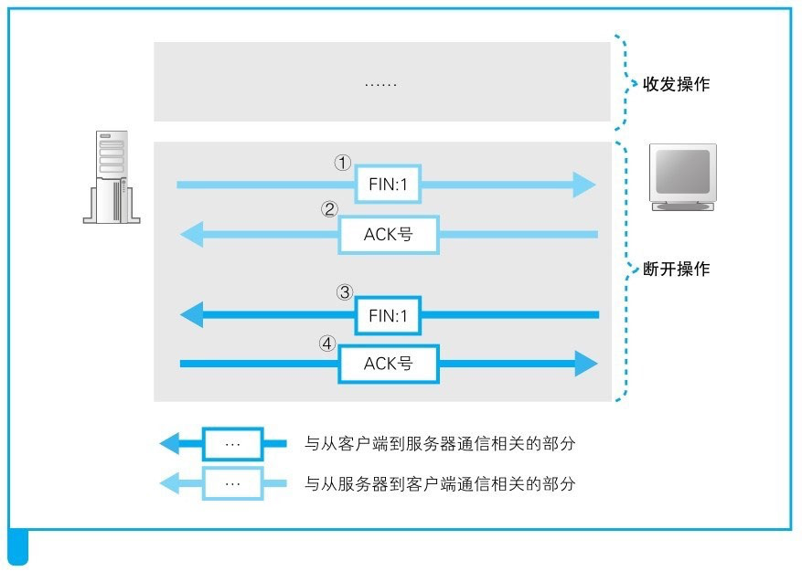

#####  TCP 的整体流程

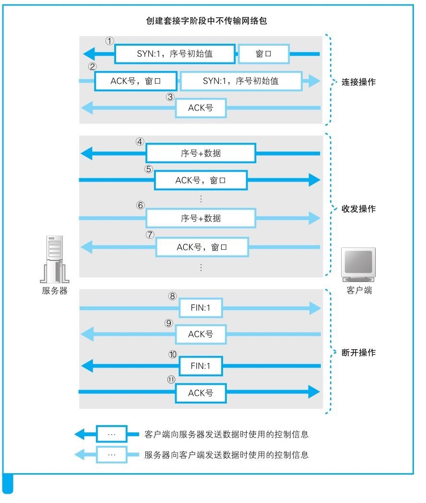

#### IP 与以太网包的收发操作

> - TCP 将网络包交付给 IP 协议，IP 协议主要做的是为包添加 MAC 头部和 IP 头部
> - IP 包中有通讯双方的 IP 地址，通过 ARP 协议找到要转发的路由器的 MAC 地址，然后拼接 MAC 头部进行数据的传输
> - IP 包的发送过程控制是有 ICMP 协议控制，ICMP 主要报告是否有包丢失以及网络出错相关信息

#### 资料来源：

> - 《网络是怎么连接的》
